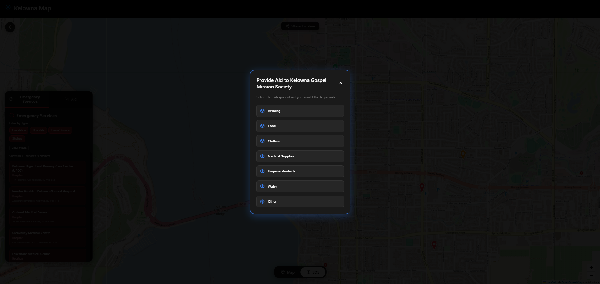
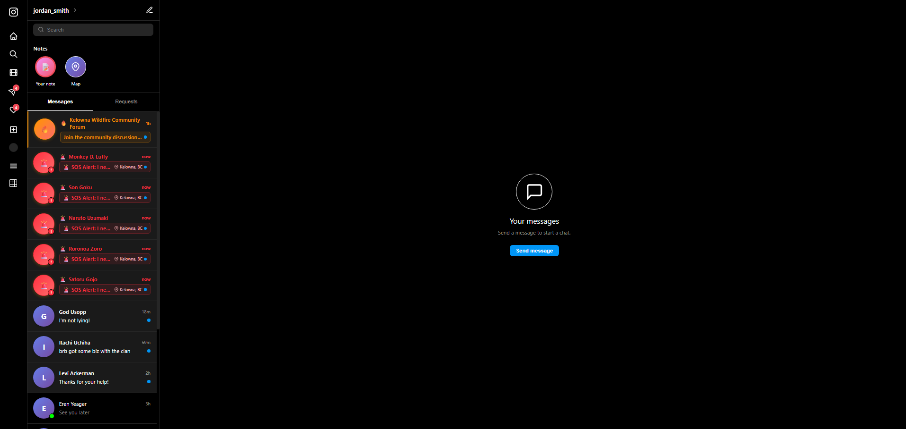

# Hackathon

## Goal

During disasters, make all information centralized by creating a **forum** for people living in the area where the disaster is happening. When the **disaster map** (SOS mode) is shown, users can see **shelters, fire stations, police stations, and hospitals** to seek resources. **Aid from people** providing help—such as different restaurants—can be availed and shown on the disaster map. The map also has an **SOS function** that alerts your closest friends of your location so they may be able to help.

## Features

- **Disaster forum** — A community forum invite appears in Messages (DMs). Tapping it shows a preview of the **Kelowna Wildfire Community Forum** with centralized updates: fire status, aid availability, shelter info, danger zones, and emergency services. Users can accept to join the discussion.
- **Kelowna map (two modes)**  
  - **Map** — Regular view with location markers and **memories** (photo pins) at saved places.  
  - **SOS (disaster map)** — Emergency view with:
    - **Fire danger zones** — Orange (moderate), red (high), and dark red (extreme) polygons with popups describing risk and evacuation guidance.
    - **Emergency services** — Filterable list and map markers for **hospitals**, **fire stations**, and **police stations**. Tap for details, get directions (Google Maps), view on Google, or call.
    - **Shelters** — Filter and list shelters with operator, type, address, and bed count. Tap a shelter for a detail modal: get directions, **reserve spots**, call, or open website. **Provide Aid** lets users choose a category (e.g. Bedding, Food, Clothing, Medical Supplies) to contribute to that shelter.
    - **Aid** — Businesses (e.g. restaurants) offering help (meals, water, coffee, parking). Shown on the map with descriptions and **Get directions**.
- **Share location & SOS** — From the map, **Share Location** offers: Public, Close Friends, or Individuals for ongoing sharing, plus **Send SOS**. SOS uses the device location (or fallback), sends an emergency alert with your location to your **close friends**, and the alert appears in their DMs with your coordinates so they can help.
- **Shelter reservation** — From any shelter’s detail modal, **Reserve Spots** opens a reservation flow where users select number of beds (1–6, up to shelter capacity) and submit. A confirmation is shown before returning to the map.
- **Access to the map** — The map is reachable from the **Messages** page via the “Map” note and from **Settings** under Relife → **Shelterfinder**.

## Tech Stack

| Technology | Purpose |
|------------|---------|
| **React** | UI framework for building the app’s pages and components |
| **TypeScript** | Type-safe JavaScript for the codebase |
| **Vite** | Build tool and dev server for fast development |
| **React Router DOM** | Client-side routing (regular map, disaster map, forum, settings, etc.) |
| **Leaflet** + **react-leaflet** | Interactive maps: regular map view and disaster map with markers for shelters, hospitals, police, fire stations, and aid |
| **Zustand** | Lightweight state management (e.g. map ref, user/settings) |
| **Tailwind CSS** | Utility-first styling and responsive layout |
| **React Icons** | Icons across the UI |

## Screenshots

### Aid

### Disaster Forum

### Disaster Map

### Regular Map

### Resource and Shelters

### SOS

### SOS Function

### Links to Shelter

### Shelter Popup

